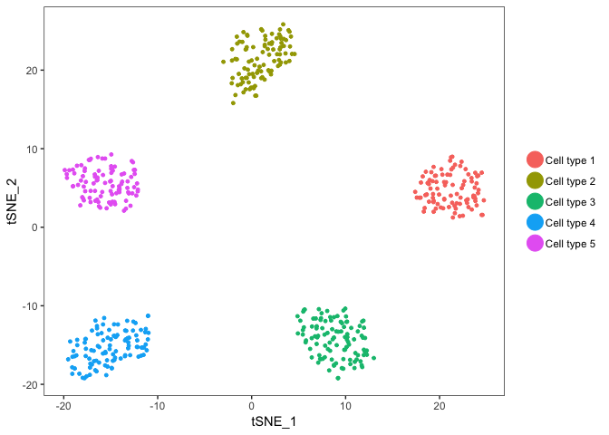
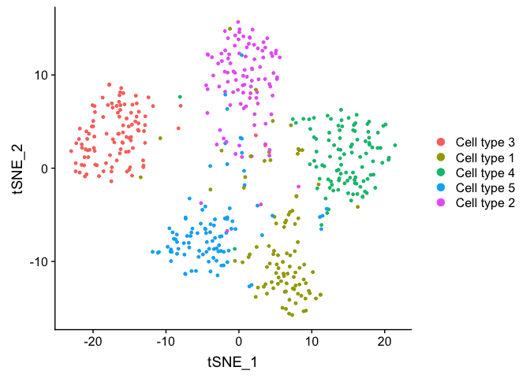
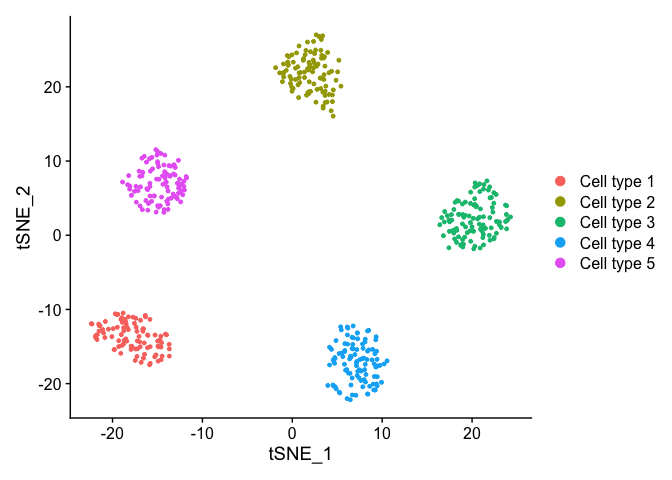

<!-- README.md is generated from README.Rmd. Please edit that file -->
README
------

This package provides a bootstrap imputation method for dropout events in scRNAseq data.

NEWS
----

> Aug. 14, 2019

-   Version 0.1.1 released!
-   Compatible with Seurat v3.
-   Informative genes may be determined using any pipeline (e.g. scran) or method and indicated with `select_genes`.

Installation
------------

``` r
install.packages("devtools", repos="http://cran.rstudio.com/")
library(devtools)
devtools::install_github("seasamgo/rescue")
library(rescue)
```

Method
------

`bootstrapImputation` takes a log-normalized expression matrix and returns a list containing the imputed and original matrices.

``` r
bootstrapImputation(
  expression_matrix,                  # expression matrix
  select_cells = NULL,                # subset cells
  select_genes = NULL,                # informative genes
  proportion_genes = 0.6,             # proportion of genes to sample
  bootstrap_samples = 100,            # number of samples
  number_pcs = 8,                     # number of PC's to consider
  snn_resolution = 0.9,               # clustering resolution
  impute_index = NULL,                # specify counts to impute, defaults to zero values
  use_mclapply = FALSE,               # run in parallel
  cores = 2,                          # number of parallel cores
  return_individual_results = FALSE,  # return sample means
  verbose = FALSE                     # print progress to console
  )
```

Similar cells are determined with shared nearest neighbors clustering upon the principal components of informative gene expression (e.g. highly variable or differentially expressed genes). The names of these informative genes may be indicated with `select_genes`, which defaults to the most highly variable. For more, please view the help files.

Example
-------

To illustrate, we'll need the Splatter package to simulate some scRNAseq data.

``` r
if (!requireNamespace("BiocManager", quietly = TRUE))
    install.packages("BiocManager")
BiocManager::install("splatter", version = "3.7")
library(splatter)
```

We'll consider a hypothetical example of 500 cells and 10,000 genes containing five distinct cell types of near equal size, then introduce some dropout events.

``` r
params <- splatter::newSplatParams(
  nGenes = 1e4,
  batchCells = 500,
  group.prob = rep(.2, 5),
  de.prob = .05,
  dropout.mid = rep(0, 5),
  dropout.shape = rep(-.5, 5),
  dropout.type = 'group',
  seed = 940
  )

splat <- splatter::splatSimulate(params = params, method = 'groups')

cell_types <- SummarizedExperiment::colData(splat)$Group
cell_types <- as.factor(gsub('Group', 'Cell type ', cell_types))
```

To visualize this data we'll use the Seurat pipeline, which imports with the rescue package.

``` r
library(Seurat)
```

First, we should remove genes that lost all counts to dropout.

``` r
counts_true <- SummarizedExperiment::assays(splat)$TrueCounts
counts_dropout <- SummarizedExperiment::assays(splat)$counts
comparable_genes <- rowSums(counts_dropout) != 0
```

Next, we normalize and scale the data.

``` r
expression_true <- Seurat::CreateSeuratObject(counts = counts_true)
expression_true <- Seurat::NormalizeData(expression_true)
expression_true <- ScaleData(expression_true, features = rownames(expression_true))

expression_dropout <- Seurat::CreateSeuratObject(counts = counts_dropout[comparable_genes, ])
expression_dropout <- Seurat::NormalizeData(expression_dropout)
expression_dropout <- ScaleData(expression_dropout, features = rownames(expression_dropout))
```

The last step is dimension reduction with PCA and then visualization with t-SNE.

``` r
expression_true <- Seurat::RunPCA(expression_true, features = rownames(expression_true), verbose = FALSE)
expression_true <- Seurat::SetIdent(expression_true, value = cell_types)
expression_true <- Seurat::RunTSNE(expression_true)
Seurat::DimPlot(expression_true, reduction = "tsne")
```



``` r

expression_dropout <- Seurat::RunPCA(expression_dropout, features = rownames(expression_dropout), verbose = FALSE)
expression_dropout <- Seurat::SetIdent(expression_dropout, value = cell_types)
expression_dropout <- Seurat::RunTSNE(expression_dropout)
Seurat::DimPlot(expression_dropout, reduction = "tsne")
```



It's clear that dropout has distorted our evaluation of the data by cell type as compared to what we should see with the full set of counts. Now let's impute zero counts to recover missing expression values and reevaluate.

``` r
impute <- rescue::bootstrapImputation(expression_matrix = expression_dropout@assays$RNA@data, bootstrap_samples = 100, use_mclapply = TRUE, cores = 3)

expression_imputed <- Seurat::CreateSeuratObject(counts = impute$final_imputation)
expression_imputed <- Seurat::ScaleData(expression_imputed)
expression_imputed <- Seurat::RunPCA(expression_imputed, features = rownames(expression_imputed), verbose = FALSE)
expression_imputed <- Seurat::SetIdent(expression_imputed, value = cell_types)
expression_imputed <- Seurat::RunTSNE(expression_imputed)
Seurat::DimPlot(expression_imputed, reduction = "tsne")
```



The recovery of missing expression values due to dropout events allows us to correctly distinguish cell types with basic data visualization techniques in this simulated example data.
